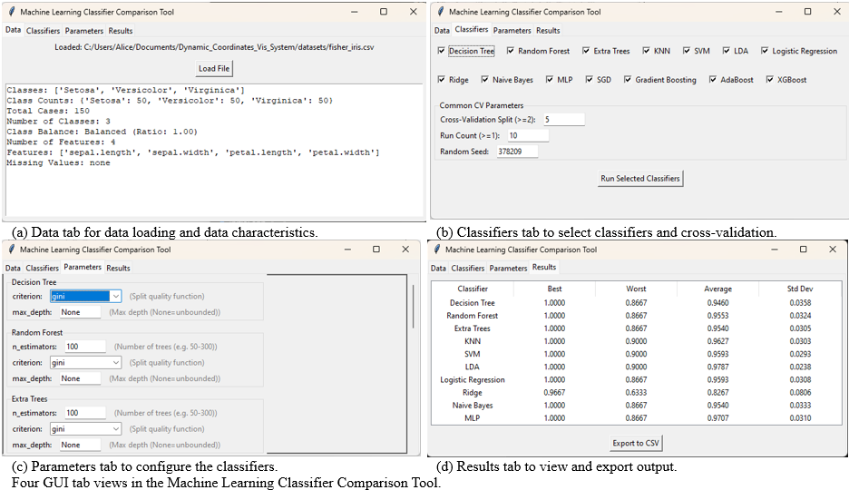

# Machine Learning Classifier Comparison GUI Application

This application is a GUI for comparing the performance of various machine learning classifiers on a dataset. It allows you to load a dataset, select a classifier, and configure various parameters to run the comparison. The results are displayed in a table and can be exported to a CSV file.

This is to benchmark the performance of various machine learning classifiers on a dataset, and to compare the performance under data synthesization and data augmentation. With the results, we can choose the best classifier for the dataset, tune the hyperparameters, observe robustness under different data splits, and choose the best data synthesization and augmentation methods.

## Features

- Load a dataset from a CSV file.
- Select a classifier from a list of available classifiers.
- Configure various parameters for the classifier, including random seed, number of splits, and number of runs.
- Run the comparison and view the results in a table.
- Export the results to a CSV file.

## License

This project is licensed under the MIT License - see the LICENSE file for details.
