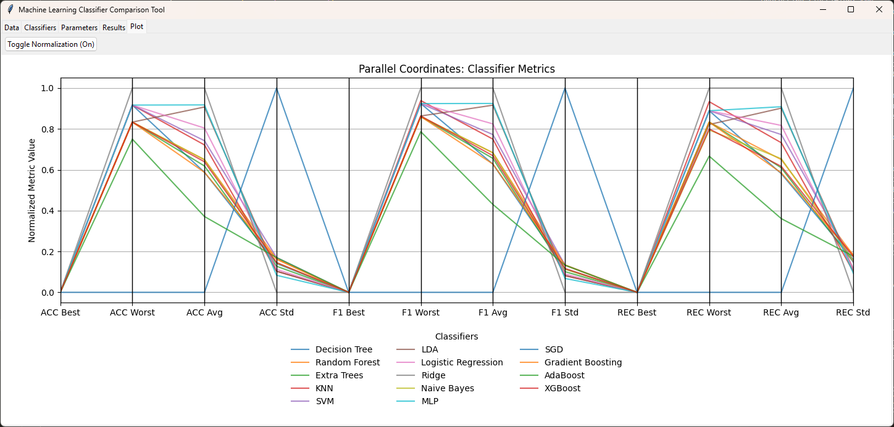

# Machine Learning Classifier Comparison Tool

The **Machine Learning Classifier Comparison Tool** helps benchmark and compare the performance of various machine learning classifiers on a dataset. It supports optional evaluation data, cross-validation (or none if splits = 1), and an embedded parallel-coordinates visualization of the final results.

## Features

- **Load Main Dataset**  
  - Load a CSV file for training/benchmarking.  
  - The tool automatically identifies the class column (requires "class" in the column name).
- **Optional Evaluation Dataset**  
  - Load a second CSV for evaluation.  
  - If provided, cross-validation is performed on the evaluation data (training always on the main dataset).
- **Flexible Cross-Validation**  
  - Set the number of folds for CV (`Cross-Validation Split`).  
  - If set to **1**, no cross-validation is performed (the entire main dataset is used for training, and either the same dataset or the evaluation dataset is used for testing).
- **Multiple Classifiers**  
  - Choose from a variety of popular algorithms (Decision Tree, Random Forest, SVM, KNN, Logistic Regression, AdaBoost, XGBoost, etc.).
- **Hyperparameter Editing**  
  - Each classifier has its own parameter panel (e.g., number of neighbors for KNN, max depth for Trees, etc.).
- **Multiple Runs**  
  - Specify the number of runs to repeat the experiment (with different seeds) for more robust statistics.
- **Results & Visualization**  
  - Best, worst, average, and standard deviation (std) for Accuracy, F1, and Recall are displayed in a results table.  
  - **Parallel Coordinates**: click “Visualize” to see an embedded parallel coordinates plot in a separate tab.  
  - Export results to CSV.
  
## Usage

1. **Load Main File** (required).  
2. **Optionally** load an **Evaluate File** if you want to test on separate data.  
3. Go to **Classifiers** tab, pick one or more algorithms, and set the cross-validation parameters (split, runs, seed).  
4. Go to **Parameters** tab to tweak each classifier’s hyperparameters.  
5. Click **Run Selected Classifiers** to benchmark.  
6. Check results in the **Results** tab.  
   - Export to CSV if desired.  
   - Click **Visualize** to see a parallel coordinates chart in the **Plot** tab.

## Getting Started

1. Clone the repository
2. Run `pip install numpy pandas scikit-learn xgboost catboost lightgbm matplotlib pyyaml`
3. Run the `main.py` file

## Planned Enhancements

- [ ] Explore further graphical summaries (e.g., box plots, bar charts).
- [ ] Automatic hyperparameter tuning with grid or random search.

## License

This project is licensed under the [MIT License](LICENSE).
